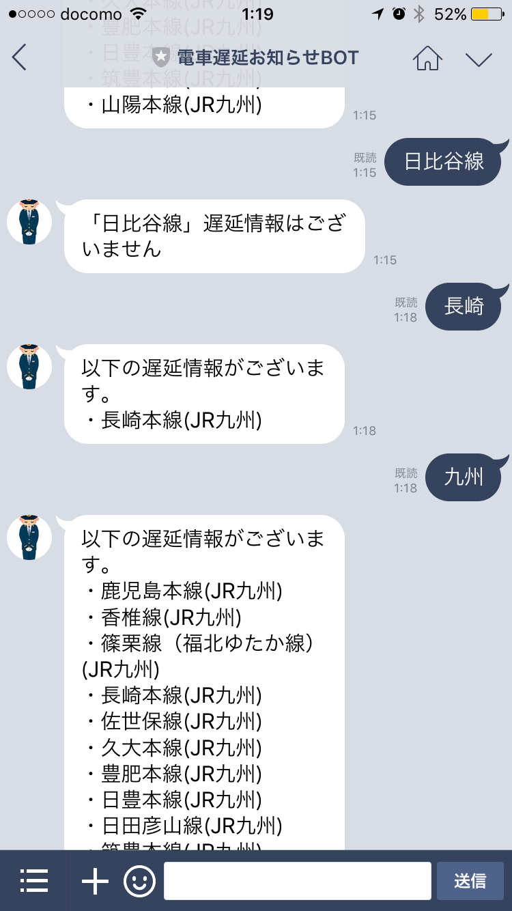

## 概要
電車の路線名（山手線、中央線、丸ノ内線など）を送ると、遅延発生しているかどうかを知らせてくれる「電車遅延お知らせBOT」を以前作りました。
http://qiita.com/k1_style/items/67e548959374e34ce751

昨年LINEがBOT API Trialを止めてMessagingAPIを新たにリリースしたため、当BOTもこの仕様に合わせて作り変えました。  
BOT API Trialが終了して3ヶ月も経って、ようやく重い腰を上げました。すみません。。

## BotのQR Code

LINE利用しているみなさま、またココからおともだちになってください！

## 使い方イメージ

↑こんな感じで電車の路線名または企業名を送ると、遅延発生している情報を拾って知らせてくれます。

前回は路線名の完全一致のみで対応してましたが、  
今回は部分一致で当てはまる遅延情報全て表示させるように修正しました。

## 使った技術
- [LINE Messaging API](https://devdocs.line.me/ja/)
- [Serverless Framework](https://serverless.com/)
  - node.jsを採用し、AWS上で動かすようにしました。
- [鉄道遅延情報のjson](https://rti-giken.jp/fhc/api/train_tetsudo/)

前回はGoogleAppsScriptでかんたんに実装しました。が、  
node.jsを利用したローカル開発やテストを実際に試してみたくなり、  
どうせならAWSでより実用的な運用方法を目指したくなってServerlessFrameworkを導入してみました。

## 実装
GitHubにソースコードを上げました。  
https://github.com/K1-Style/line-train-bot

### LINE Developerアカウント用意
以下の記事をかなり参考にさせていただきました。  
[Serverless FrameworkでLINE BOTが簡単にできちゃった](http://qiita.com/narikei/items/8c6cd9e05621dcd444e5)

### ローカルで開発を行う場合
Serverless FrameworkでAWSを使ったサービスを作る場合は、事前に以下公式ドキュメントに目を通してください。
https://serverless.com/framework/docs/providers/aws/guide/

また、上記serverless.ymlを見ればおわかりとは思いますが、
以下の環境変数を事前に定義しておいてください。
- LINE_ACCESS_TOKEN
  - LINE BOTのアクセストークン  
  (LINE Developersアカウント用意すると取得できます)
- LINE_CHANNEL_SECRET
  - LINE BOTのCHANNEL SECRET  
  (LINE Developersアカウント用意すると取得できます)  
  (リクエストの送信元チェックで利用)
- AWS_PROFILE
  - 使用するAWS環境のcredencial profile名。  
  (デフォルトを利用する場合はprofileの定義は無くて良いです)

### テスト
[mocha](https://mochajs.org/),[chai](http://chaijs.com/)を利用して、自分が独自に作った関数(utilディレクトリ以下)のテストを作ってます。  
`npm test`って実行すると、testディレクトリ以下のテストソースが実行されるようになってます。

## その他
### アイコン（いらすとやさん）
http://www.irasutoya.com/2014/06/blog-post_9691.html  
前回に引き続きBOTアイコンとして採用させていただきました。

### 不具合や要望がございましたら、
[GitHub](https://github.com/K1-Style/line-train-bot)でissueやプルリクいただけるとうれしいです!

### 余談
[LINE BOT AWARDS](https://botawards.line.me/ja/)にて当Botエントリーしました。  
暇を見つけては改良を加えていこうかなと思ってます。
